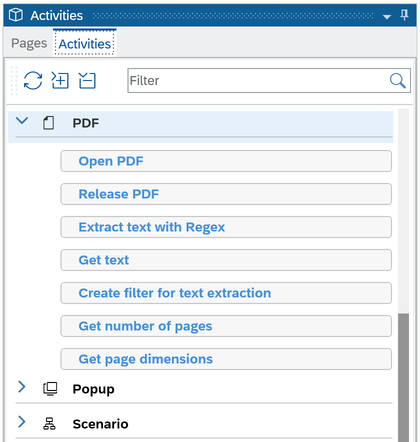
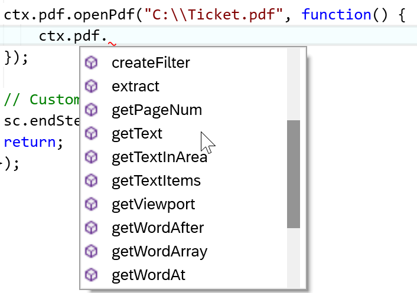
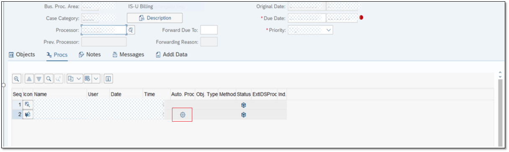
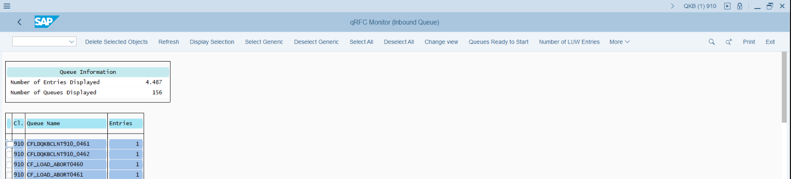
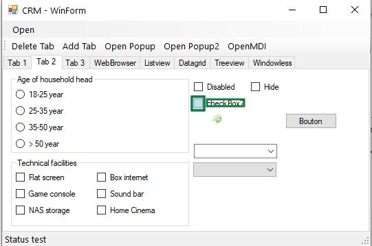

#

# 2003 버전부터는 SAP Intelligent RPA Trial의 일부 할당량이 증가했습니다.

- `Cloud Project` 10개 -> 20개로 증가
- `Package` 생성/가져오기 20개 -> 30개로 증가
- `Trigger` 20개 -> 30개로 증가

# 새로운 기능

## 문서 처리 – PDF

`2004 Release`에서는 Desktop Studio 에 PDF에 대한 새로운 Activity/Method가 추가됐습니다. 이러한 Activity/Method를 사용하면 이제 읽을 수있는 PDF 파일에서 텍스트를 열고 추출할 수 있습니다.

- 전체 텍스트 추출
- 필터를 사용하여 페이지의 특정 페이지 또는 영역을 검색하거나 검색
- 정규식(regExp)를 사용하여 텍스트 추출과 고유 패턴(예 : 송장 번호, 가격 또는 날짜) 추출 가능
- 특정 단어를 검색하고 결과의 정확한 위치를 얻습니다.

  
**[Fig1. Release 2004]**

읽을 수 있는 PDF 파일에서 텍스트 추출을 정확하게 제어할 수 있는 SDK 기능도 제공됩니다.

  
**[Fig1. Release 2004]**

## Windows 용 SAP GUI 개선

SAP Intelligent RPA 2004 Release에서 Windows 용 SAP GUI의 향상을 포함하여 추가 커넥터 개선이 가능합니다.

GuiGridView Component에 새로운 `Click Button Cell` Activity가 제공되어 GridTable Cell안에 있는 Button을 클릭할 수 있습니다.

  
**[Fig1. Release 2004]**

또한 GuiUserArea Component에 대한 새로운 스크롤 기능이 추가되었습니다. 

- `Scroll to next page` activity : 세로 스크롤 막대가있는 경우 아래로 스크롤

- `Scroll To previous page` activity : 세로 스크롤 막대가 있는 경우 위로 스크롤

  
**[Fig1. Release 2004]**

## Improvements in Surface Automation (OCR)

### Multi-Template Matching

2004 Release에서는 `Multi-Template Matching` 기능이 추가되었습니다. 템플릿 일치는 대상 위치에 관계없이 텍스트가 아닌 영역을 포함하여 사용자 인터페이스에서 사전 선택된 패턴의 감지를 지원합니다. 다중 템플릿 일치 기능은 화면에 이미지 패턴에 대한 여러 후보가있을 때 일치 정확도를 높입니다.

With the 2004 release, we have added a multi-template matching feature. Template matching supports the detection of any pre-selected pattern on a user interface, including non-textual areas, regardless of the target location. The multi-template matching feature increases matching accuracy when there are multiple candidates for an image pattern on the screen.

`Multi-Template Matching`는 "Labelled By"속성을 통해 지정된 참조 레이블을 사용하여 정확한 좌표에 의존하지 않는 런타임시 대상 이미지 패턴의 위치를 ​​식별하는 방법을 제공합니다.

아래의 예시 화면에서“Checkbox7”이라고 표시된 체크 박스 템플릿을 타겟팅하고 싶습니다. 런타임시 여러 개의 적중이 있더라도 이 레이블을 사용하여 올바른 선택란이 식별됩니다.

  
**[Fig1. Release 2004]**

### OCR Neighboring Controls Text Match

디자인 타임에 항목 좌표를 사용하여 응용 프로그램 페이지에서 텍스트 항목을 식별한다고해서 항상 필요한 결과가 나오지는 않습니다. 런타임시 페이지 레이아웃이 다를 수 있기 때문입니다. 2004 Release에서는 이제 x 또는 y 축 또는 두 가지 조합을 따라 가장 가까운 텍스트를 사용하도록 선택할 수 있습니다. 다음 항목 속성 중 하나 또는 둘 다에서이를 구성 할 수 있습니다.

Nearest match along width (%): :이 값은 응용 프로그램 페이지 (화면)의 너비와 비교 한 편차 마진 백분율을 나타냅니다. 런타임시 x 축을 따라 가장 가까운 텍스트가 일치합니다.

Nearest match along height (%) :이 값은 응용 프로그램 페이지 (화면)의 너비와 비교 한 편차 마진 백분율을 나타냅니다. 런타임시 y 축을 따라 가장 가까운 텍스트가 일치합니다.

두 속성 모두 값의 범위는 0에서 100 사이입니다. 기본값은 0이며이 기능은 비활성화되어 있음을 의미합니다. 런타임시 편차가 구성된 백분율 값보다 큰 경우 텍스트가 인식되지 않습니다.