# 1. iRPA 개발 툴 (Desktop Studio) 설치 및 설정

## 1. Desktop Studio(iRPA Bot Dev Tool on-premise)

+ # 설치파일

        + sap-intelligent-rpa-1.0.5.57_trial.msi

        + jdk-8u221-windows-x64.exe (기존 설치된 jdk가 있을 경우 건너뜀)

        + KDiff3-64bit-Setup_0.9.98.exe

        + NDP472-KB4054531Web.exe

        + node-v10.15.3x64.msi (기존 설치된 node가 있을 경우 건너뜀)

        + vs_remotetools.exe

+ # 설치방법

    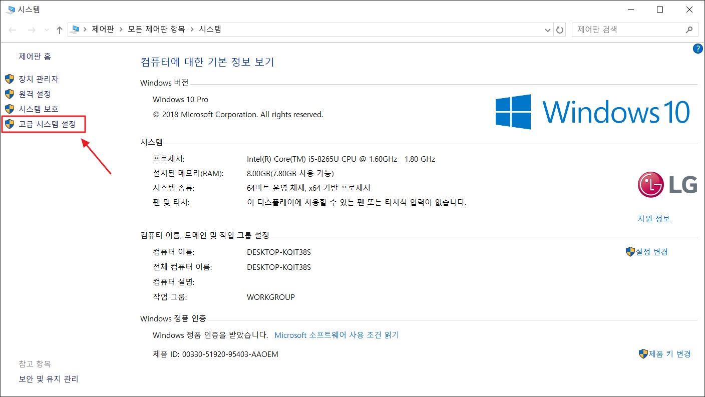

    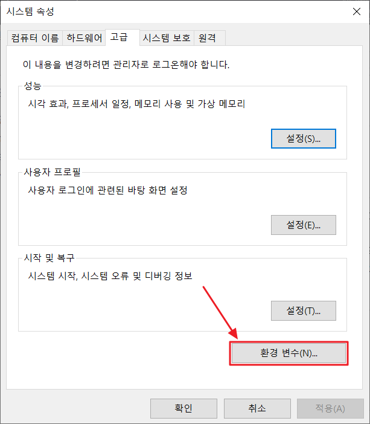

    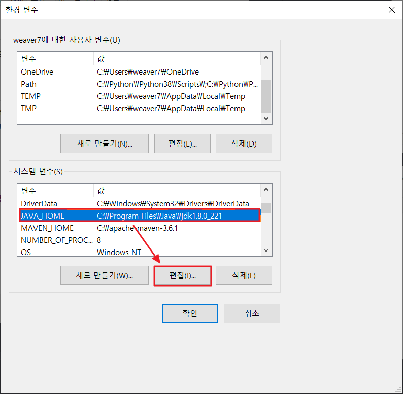

    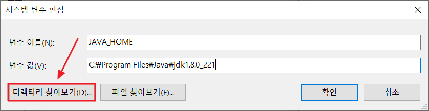

    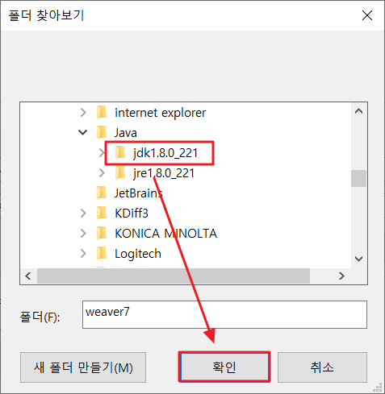

    **설치된 JDK 경로 : `C:\Program Files\Java\jdk1.8.0_221`**

    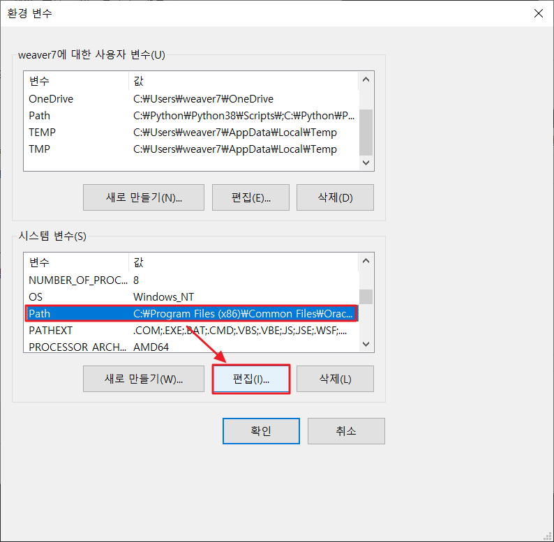

    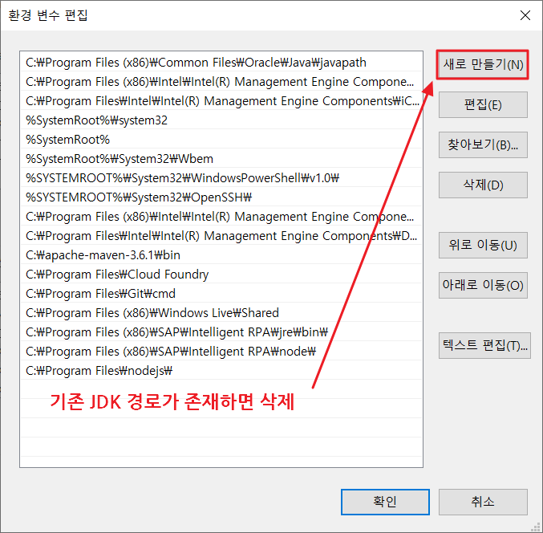

    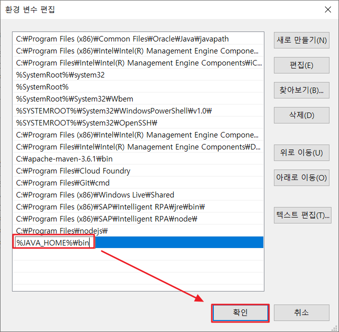

    **`%JAVA_HOME%\bin`** 입력후 저장

    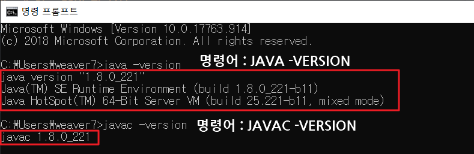

    **`java -version`**

    **`javac -version`**

    

    **`node -v`**

+ # 해상도 설정

    -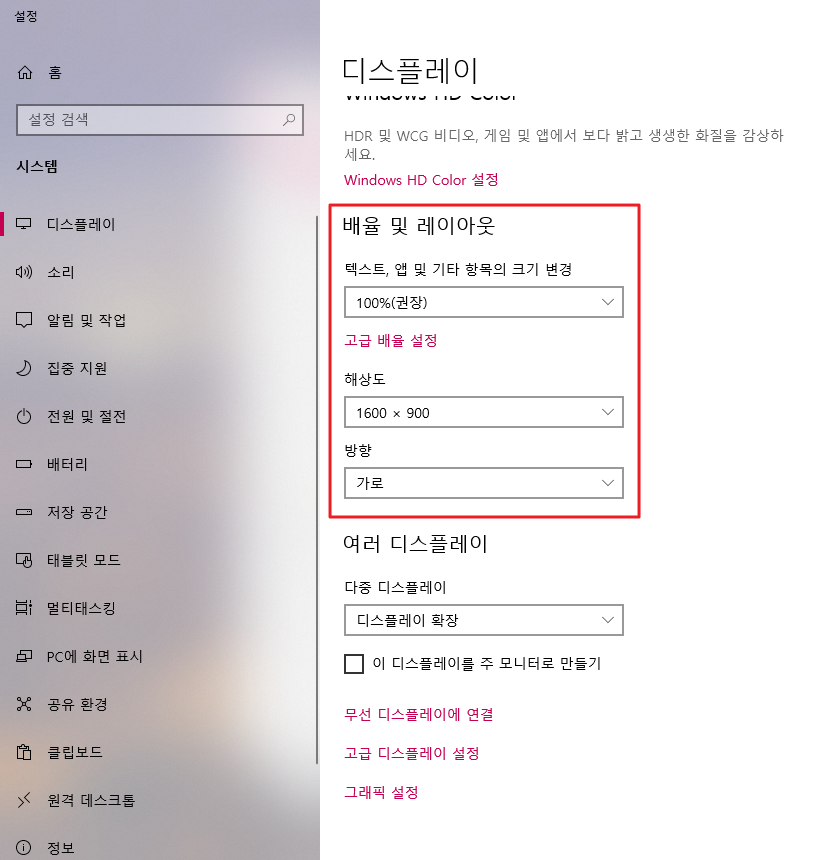

+ # KDiff3 설정(코드 Merge 툴)

+ ## Desktop Studio 프로그램 실행

    

    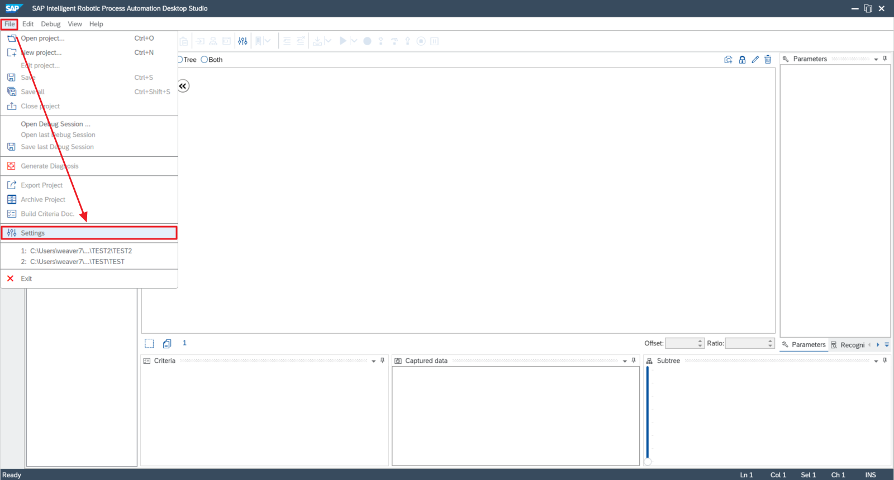

    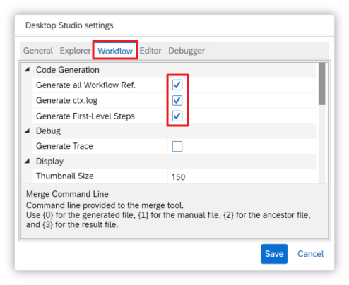

    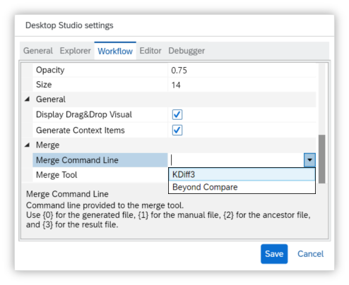

    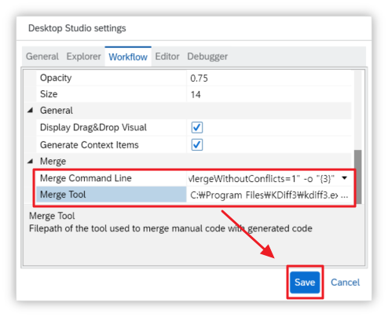

+ # Library Integration 활성 방법 (ex. MS Office Excel/Word/PowerPoint)

    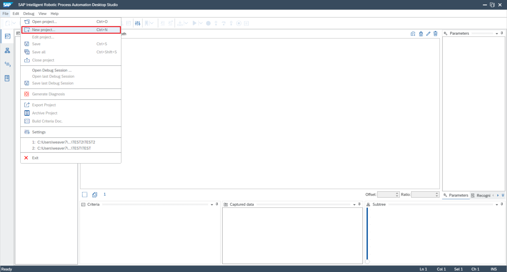

    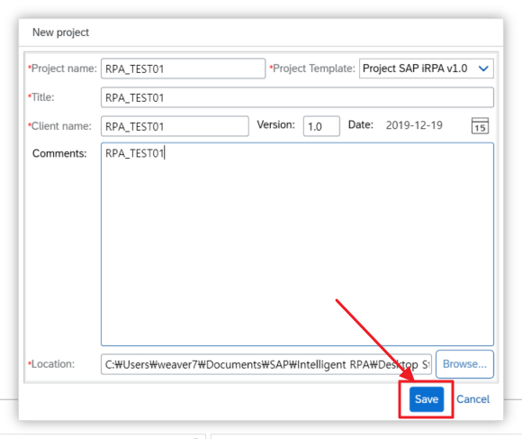

    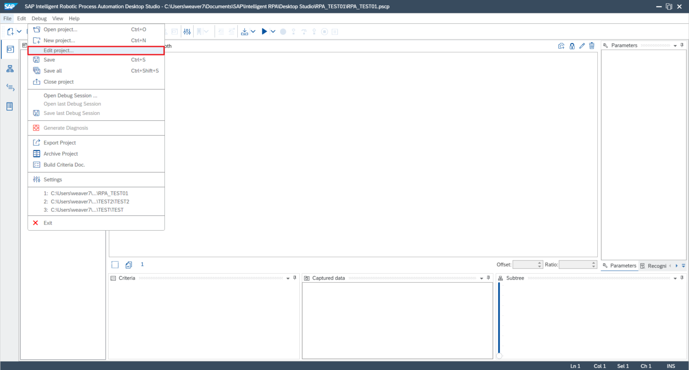

    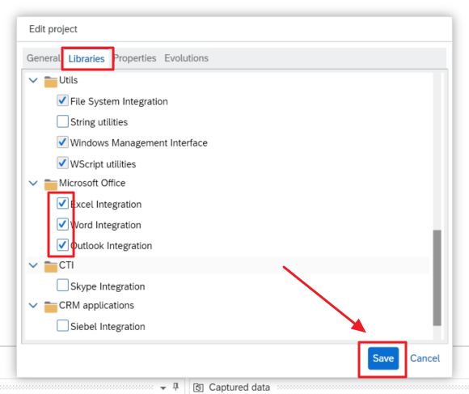